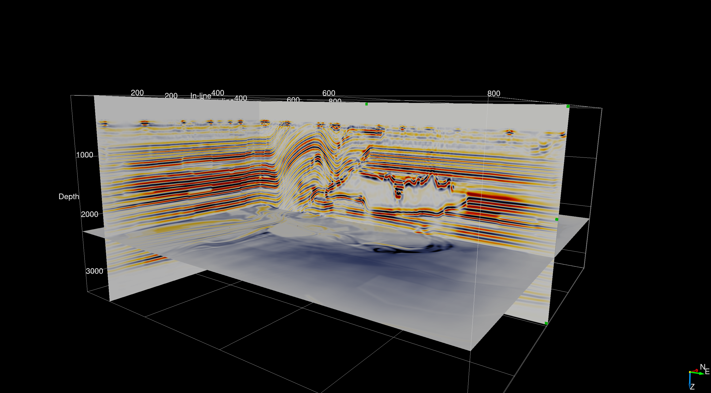
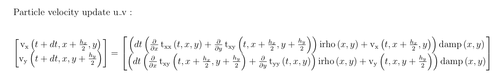

## Abstract

[Devito] is an open-source Python project based on domain-specific languages and compiler technology originally devised for rapid implementation of high performance applications in exploration seismology, where popular inversion methods such as Full-Waveform Inversion and Reverse-Time Migration are used to create images of the earth's subsurface. Throughout several years of development, and thanks to the feedback of companies and community, both the language and compiler have deeply evolved. Today, sophisticated boundary conditions, tensor contractions, sparse operations (e.g., interpolations), as well as fundamental features such as staggered grids and sub domains, are supported and may be used altogether in the same code. There is virtually no limit to the complexity of a Devito operator. To support all of this flexibility and to ensure competitive performance, the compiler relies on a generic framework for data dependency analysis to schedule loops and detect computational properties, such as parallelism. In this article we harness all this potential to show that Devito is ready for large-scale production-grade seismic inversion problems. We have used  Devito to generate MPI-parallel wave propagators -- as well as their corresponding adjoints -- for the pseudo-acoustic anisotropic wave-equation in a transverse tilted isotropic media and for the elastic wave-equation and ran them on a synthetic industry scale datasets in an HPC cloud system, reaching the performance of 28TFlop/s.

## Introduction


- Devito symbolic dsl + compiler
- Acoustic isotropic is trivial, real world is at the bare minimum elastic.
- Staggered finite-difference is tedious to implement and line-by-line vectorial equation is very time consuming and error-prone (9 equation for 3D elastic, 115 for viscoelastic).

Devito supports now Vectorial and second-order tensorial symbolic expressions and automatic finite-difference stencil generation. This support allows extremely simple and mathematical implementation of vectorial equation as the math writes.


## Devito

We first introduce Devito [@devito-api, @devito-compiler], and describe the capabilities that enabled the real world applications we present in the following sections. Devito, originally, is a finite-difference domain-specific language (DSL) built on top of `Sympy` [@sympy] that provides a high-level symbolic interface for the definition of partial differential equations (PDE). Devito then automatically generates the finite-difference stencil associated with the PDE and support both cartesian and staggered grid finite-difference. This stencil is then passed to the Devito compiler that generates and compiles (just-in-time compilation) C-code that is optimized for the architecture at hand. In previous work, we have focused on the DSL and the compiler to highlight the potential application and use cases. In this paper, we extend previous work to real world application such as multi-node elastic modelling[@...], and multi-experiment seismic imaging in an anisotropic media [@virieux, @thomsen, @zhang2011, @duveneck, @louboutin2018segeow]. We briefly describe the symbolic API and compiler and give a brief overview of the computational performance of the generated code.

### Symbolic API

The core of the symbolic API relies on three types of object:

- `Grid` that defines the discretized model.
- `(Time)Function` that defines a spatially (and time) varying symbolic object on the `Grid`
- `Sparse(Time)Function` that defines a (time varying) point-wise object on the grid.

A `Grid` represent a discretized finite n-dimensional space and is created as follows:

```python
from devito import Grid
grid = Grid(shape=(nx, ny, nz), extent=(ext_x, ext_y, ext_z), origin=(o_x, o_y, o_z))
```

where `(nx, ny, nz)` are the number of grid points in each direction, `(ext_x, ext_y, ext_z)` is the physical extent of the domain in physical units (i.e `m`) and `(o_x, o_y, o_z)` is the origin of the domain in the same physical units. The `grid` then contains all the information related to the discretization such as the grid spacing, and automatically initializes the `Dimension` that define the domain `x, y, z`. With this grid, the symbolic objects can be created for the discretization of a PDE. First, we can define a spatialy varying model parameter `m` and a time-space varying field `u`

```python
from devito import Function, TimeFunction
m = Function(name="m", grid=grid, space_order=so)
u = TimeFunction(name="u", grid=grid, space_order=so, time_order=to)
```

where `so` is the spatial discretization order and `to` the time discretization order that is used for the generation of the finite-difference stencil. Second, we can define the point-wise object such as a point source `src` located at the physicall coordinates `s_coords` and a receiver (measurement) object `rec` with sensors located at the physical locations `r_coords`.

```python
from devito import Function, TimeFunction
src = SparseFunction(name="src", grid=grid, npoint=1, coordinates=s_coords)
rec = SparseTimeFunction(name="rec", grid=grid, npoint=1, nt=nt, coordinates=r_coords)
```

From these object, we can define, as an example, the acoustic wave-equation in five lines as:

```python
from devito import solve, Eq, Operator
eq = m * u.dt2 - u.laplace
stencil = [Eq(u.forward, solve(eq, u.forward))]
src_eq = s1.inject(u.forward, expr=s1 * dt**2 / m)
rec_eq = rec.interpolate(u)
wave_solve = Operator(stencil _ src_eq + rec_eq)
```

The compiler then evaluates the finite-difference expressions and generate the C code associated with it threw passes such as common subexpression elimination, factorization, cross-iteration redundancies elimination or time-invariant extraction. These compiler details are described in [@devito-compiler] while the symbolic API is gully presented in [@devito-api]. We know give a brief description of the distributed memory parallelism implemented and available in Devito that has been used for the two applications we present in this paper.

### Overview of distributed-memory parallelism

We here provide a minimal description of distributed-memory parallelism in Devito; the interested reader should refer to [@mpi-notebook] for thorough explanations and practical examples.

Devito implements distributed-memory parallelism on top of MPI. The design is such that users can almost entirely abstract away from it. Given *any* Devito code, just running it as

```python
DEVITO_MPI=1 mpirun -n X python ...
```

will trigger the compiler to generate C with routines for halo exchanges. The routines are scheduled at a suitable depth in the various loop nests thanks to data dependency analysis. The following optimizations are automatically applied:

* redundant halo exchanges are detected and dropped;
* computation/communication overlap, with prodding of the asynchronous progress engine by a designated thread through repeated calls to `MPI_Test`;
* a halo exchange is placed as far as possible from where it is needed to maximize computation/communication overlap;
* data packing and unpacking is threaded.

The domain decomposition occurs in Python upon creation of a `Grid` object. Exploiting the MPI Cartesian topology abstraction, Devito logically splits a grid based on the number of available MPI processes (users are given an "escape hatch" to override Devito’s default decomposition strategy). `Function` and `TimeFunction` objects inherit the `Grid` decomposition. For `SparseFunction` objects the approach is different. Since a `SparseFunction` represents a sparse set of points, Devito looks at the physical coordinates of each point and, based on the `Grid` decomposition, schedules the logical ownership to an MPI rank. If a sparse point lies along the boundary of two or more MPI ranks, then it is duplicated to be accessible by all neighboring processes. Eventually, a duplicated point may be redundantly computed by multiple processes, but any redundant increments will be discarded.

When accessing or manipulating data in a Devito code, users have the illusion to be working with classic NumPy arrays, while underneath they actually are distributed. All manner of NumPy indexing schemes (basic, slicing, etc.) are supported. In the implementation, proper global-to-local and local-to-global index conversion routines are used to propagate a read/write access to the impacted subset of ranks. For example [@rhodrin ADD A TINY YET FANCY EXAMPLE HERE].

Finally, we remark that while providing abstractions for distributed data manipulation, Devito does not support natively any mechanisms for parallel I/O.


### Scalability

In previous work, we presented extensive benchmarking of Devtio through the roofline model to demonstrate the performance of the generated code from an architecture point of view [@devito-compiler, @devito-api, ...]. We know show scaling benchmark for shared memory parallelism (openMP) and distributed-memory parallelism (MPI) for different kernels. This scalability analysis demonstrate that the generated code implements all the necessary statement for state of the art parallelism.

We first look at the weak scaling for shared parallelism. This experiment was ran on [@rhodri not sure what the arch is on cx2, i can ask george too] and shown on Figure #OMPScaling.

#### Figure: {#OMPScaling}


The scaling shows that Devito scales nearly perfectly for all four kernels that range from extremely memory bound to almost compute bound. This results demonstrates the the shared memory parallelism implemented in the Devito compiler generates the C code with the correct pragmas and vectorization statements.

Second, we look at the weak saling from a distributed parallelism point of view. This time we ran the experiment on [@rhodri] and we show the results on Figure #MPIScaling.
#### Figure: {#MPIScaling}


The MPI scaling shows that for compute bound kernels such as TTI (c.f Eq #TTIfwd, Table #ttiflops), the scaling follows the expected near-optimal trend, while for memory bound kernels such as the acoustic wave equation, the scaling is sub-optimal. These results can be expected (see [put ref] for example) and hows that once again Devito implements distributed memory in an efficient way and performs as we would expect of a hand coded implementation.

## Performance comparison

To furthermore validate the computational performance of Devito, and thanks to the vectorial extension we present in Section #elastic, we compared the runtime of Devito with a reference open source hand-coded propagator in collaboration with its author. This propagator, described in[@thorbecke] is a state of the art elastic kernel [@...]. The source code can be found at [fdelmodc]. We compared the runtime of Devito against [fdelmodc] for a fixed and common computational setup from one of their examples:

- 2001 by 1001 physical grid points.
- 200 grid points of dampening layer (absorbing layer [@cerjan]) on all four sides (total of 2401x1401 computational grid points).
- 10001 time steps.
- Single point source, 2001 receivers.
- Same compiler (gcc/icc) to compile [fdelmodc] and run Devito.
- Intel(R) Xeon(R) CPU E3-1270 v6 @ 3.8GHz.
- Single socket, four physical cores, four physical threads, thread pinning to cores and hyperthreading off.

The runtime results are summarized in Table #bench-comp and show on average that Devito performs around 75\% faster with the intel compiler and 40\% faster with gcc.

#### Table: {#bench-comp}
|   Compiler      |   Devito kernel  |  Devito runtime   |  FDELMODC runtime  | Kernel speedup | Runtime speedup|
|:----------------|:-----------------|:------------------|:-------------------|:---------------|:---------------|
| GCC 9.2.0       | 166.07s          |  172.83s          |     237.52s        | 1.430          | 1.374          |
| ICC 19.1.0      | 131.59s          |  136.85s          |     237.17         | 1.802          | 1.733          |

:Runtime comparison between Devito and [fdelmodc] for a two dimensional elastic model [@thorbecke]. The first column shows the kernel runtime of Devito and the second column shows the total runtime including code generation and compilation. Only the runtime of [fdelmodc] is shown as the kernel and libraries are precompiled.

This comparison illustrate the performance achieved with Devito is at least on par with hand coded propagators. Future work will aim at providing a thorough benchmark by comparing first against a three dimensional implementations and second against state of the art stencil language.

## 3D anisotropic imaging

Code for reproducibility can be found at [AzureTTI] that contains, the propagators and gradient computation, Dockerfiles and azure [batch-shipyard] setup for running the RTM.

In this section, we highlight why high-level interfaces are extremely important for easy and rapid development of simulation and inversion codes in exploration geophysics. The example we choose is an anisotropic representation of the physics called Transverse Tilted Isotropic (TTI) [@thomsen1986]. This representation for wave motion is one of the most widely used in exploration geophysics since it captures the leading order kinematics and dynamics of acoustic wave motion in highly heterogeneous elastic media where the medium properties vary more rapidly in the direction perpendicular to sedimentary strata [@alkhalifah2000; @baysal1983; @bubetti2012; @bubetti2014; @bubesatti2016; @chu2011; @duveneck; @fletcher; @fowlertti2010; @louboutin2018segeow; @whitmore1983; @witte2016segpve; @xu2014; @zhang2005; @zhang2011; @zhan2013]. The TTI wave equation is an acoustic, low dimensional (4 parameters, 2 wavefields) simplification of the 21 parameter and 12 wavefields tensorial equations of motions [@hooke]. This simplified representation is parametrized by the Thomsen parameters ``\epsilon(x), \delta(x)`` that relate to the global (many wavelength propagation) difference in propagation speed in the vertical and horizontal directions, and the tilt and azimuth angles ``\theta(x), \phi(x)`` that define the rotation of the vertical and horizontal axis around the cartesian directions. However, unlike the scalar isotropic acoustic wave-equation itself, the TTI wave equation is extremely computationally costly to solve and it is also not self-adjoint. The TTI wave-equation reads as follows:

```math {#TTIfwd}
&m(x) \frac{d^2 p(x,t)}{dt^2} - (1+2\epsilon(x))H_{\bar{x}\bar{y}}p(x,t) - \sqrt{1+2\delta(x)} \ H_{\bar{z}} r(x,t) = q,  \\
&m(x) \frac{d^2 r(x,t)}{dt^2} - \sqrt{1+2\delta(x)} \ H_{\bar{x}\bar{y}} p(x,t) - H_{\bar{z}} r(x,t) = q,
```

where ``p(x,t)`` and ``r(x,t)`` are the two component of the anisotropic wavefield and ``H_{\bar{z}}`` and ``H_{\bar{x}\bar{y}} = G_{\bar{x}\bar{x}} + G_{\bar{y}\bar{y}}`` are the rotated second order differential operators that depend on the tilt, azimuth  (``\theta(x), \phi(x)``) and the conventional (isotropic) cartesian spatial derivatives ``\frac{d}{dx}, \frac{d}{dy}`` and ``\frac{d}{dz}``.

After discretization, the TTI wave-equation can be rewritten in a linear algebra form:

```math {#TTIfwd-la}
 \mathbf{m}  \begin{bmatrix}\frac{\mathrm{d}^2 \mathbf{p}}{\mathrm{d} t^2} \\\frac{\mathrm{d}^2 \mathbf{r}}{\mathrm{d} t^2} \end{bmatrix} &=  \begin{bmatrix} (1 + 2\mathbf{\epsilon})H_{\bar{x}\bar{y}} & \sqrt{1 + 2 \mathbf{\delta}}\ H_{\bar{z}} \\ \sqrt{1 + 2 \mathbf{\delta}} \ H_{\bar{x}\bar{y}} & H_{\bar{z}} \end{bmatrix} \begin{bmatrix} \mathbf{p} \\ \mathbf{r} \end{bmatrix} + \mathbf{P}_s^\top \mathbf{q}
```

where the bold font represents discretized version of the wavefield and physical parameters. With this expression, we can rewrite the solution of the anisotropic wave equation as the solution of a linear system ``\mathbf{u}(\mathbf{m}) = \mathbf{A}(\mathbf{m})^{-1} \mathbf{P}_s^\top`` where ``\mathbf{u}(\mathbf{m})`` is a two component vector ``(\mathbf{p}(\mathbf{m})^\top, \mathbf{r}(\mathbf{m})^\top)^\top``. The matrix ``\mathbf{P}_s^\top`` injects the source in both wavefield components. This matricial formulation is extremely useful for the mathematical derivation of inversion opertion such as gradients.

As discussed in @zhang2011 and @duveneck, we choose a finite-difference discretization of the three differential operators ``H_{\bar{z}}, G_{\bar{x}\bar{x}}, G_{\bar{y}\bar{y}}`` that is self-adjoint to ensure numerical stability. For example, we define ``G_{\bar{x}\bar{x}}`` as a function of the discretized tilt ``\mathbf{\theta}`` and azymuth ``\mathbf{\phi}`` as:

```math {#rot}
  G_{\bar{x}\bar{x}} &= D_{\bar{x}}^T D_{\bar{x}} \\
  D_{\bar{x}} &= \cos(\mathbf{\theta})\cos(\mathbf{\phi})\frac{\mathrm{d}}{\mathrm{d}x} + \cos(\mathbf{\theta})\sin(\mathbf{\phi})\frac{\mathrm{d}}{\mathrm{d}y} - \sin(\mathbf{\theta})\frac{\mathrm{d}}{\mathrm{d}z}.
```

Because of the very high number of floating-point operations (FLOP) needed per grid point for the weighted rotated Laplacian, this anisotropic wave-equation is extremely challenging to implement. As we show in Figure #ttiflops, and previously analysed in [@louboutin2016ppf], the computational cost with high-order finite-difference is in the order of thousands of FLOPs per grid point without optimizations.

#### Table: {#ttiflops}
|                 | Flops dse=noop   |  Flops dse=basic  | Flops dse=advanced | Flops dse=aggressive|
|:----------------|:-----------------|:------------------|:-------------------|:---------------|
| space_order=4   | 501              |  217              |     175            | 95             |
| space_order=8   | 539              |  301              |     238            | 102            |
| space_order=12  | 1613             |  860              |     653            | 160            |
| space_order=16  | 5489             |  2839             |     2131           | 276            |

: Per-grid-point flops of the finite-difference stencil for the TTI wave-equation with different spatial discretization orders.

Consequently, the implementation of a solver for this wave-equation can be time-consuming and can lead to thousands of lines of code and the verification of its result becomes challenging as any small error is effectively untrackable and any change to the finite-difference scheme or to the time-stepper is nearly impossible to achieve without substantial re-coding. Another complication stems from the fact that practitioners of seismic inversion are often geoscientists and not computer scientists/programmers. Unfortunately, this background often either results in poorly written low performant codes or it leads to complications when research codes are handed off to computer scientists who know how to write fast codes but who often miss the necessary geophysical domain knowledge. Neither situation is conducive to addressing the complexities that come with implementing codes based on the latest geophysical insights in geophysics and high-performance computing. Devito with its high level interface and state-of-the art just-in-time compiler addresses these complications by enabling geophysical domain experts to express themselves while offering sufficient flexibility to make the code suitable for industrial applications. Aside from these practical industrial considerations, obtaining correct and numerically stable implementations for the adjoint TTI wave-equation also has proven to be challenge in the past.

Simulation of wave motion is only one aspect of solving problems in seismology. During wave-equation based imaging, we also need to compute sensitivities (gradient) with respect to the quantities of interest. This imposes additional constraints on the design and implementations of our simulation codes as outlined in [@virieux]. Among several factors, such as fast setup time etc., we focused on correct and testable implementations for the adjoint wave equation and the gradient (action of the adjoint Jacobian) [@louboutin2018segeow, @louboutin2020THmfi].

## 3D TTI RTM in the Cloud

One of the main challenges in modern HPC is to modernize legacy codes for the cloud, which are usually hand-tuned or designed for on-premise clusters with a known and fixed architecture and setup. Porting these codes and algorithms to the cloud can be straightforward using a lift-and-shift strategy that essentially boils down to renting a cluster in the cloud. However, this strategy is not cost-efficient. Pricing in the cloud is typically based on a pay-as-you-go model, which charges for requested computational resources, regardless of whether or not instances and cores are actively used or sit idle. This pricing model is disadvantageous for the lift-and-shift strategy and oftentimes incurs higher costs than required by the actual computations, especially for communication-heavy but task-based algorithms that only need partial resources depending of the stage of the computation. On the other hand, serverless software design provides flexible and cost efficient usage of cloud resources including for large scale inverse problem such as seismic inversion. With Devito, we had access to a portable yet computationally efficient framework for wave-equation based seismic exploration that allowed us to quickly develop a new strategy to execute seismic inversion algorithms in the cloud. This new serverless and event-driven approach led to significant early results [@witte2019TPDedas, @witte2019SEGedw] that caught the attention of both seismic inverse problems practitioners and cloud providers. This led to a proof of concept project on an industry size problem in collaboration with Microsoft Azure. The main objectives of this project were:

- Demonstrate the scalability, robustness and cost effectiveness of a serverless implementation of seismic imaging in the cloud. In this case, we imaged a synthetic three dimensional anisotropic subsurface model that mimics a realistic industry size problem with a realistic representation of the physics (TTI). The physical size of the problem is `10kmx10kmx2.8km` discretized on a `12.5m` grid.

- Demonstrate the flexibility and portability of Devito. The seismic image (RTM as defined in Chapter 3) was computed with Devito and highlights the code-generation and high performance capability of Devito on an at-scale real world problem. This result shows that in addition to conventional benchmark metrics such as soft and hard scaling and the roofline model, Devito provides state of the art performance on practical applications as well.

***Computational performance***

We briefly describe the computational setup and the performance achieved for this anisotropic imaging problem. Due to time constraints, and because the resources we were given access to for this Proof of concept with Microsoft Azure were limited, we did not have access to HPC virtual machines (BM) nor Infiniband enabled ones. The nodes we ran this experiment on are `Standard_E64_v3` and `Standard_E64s_v3` that while not HPC VM are memory optimized allowing to save the wavefield in memory for imaging (TTI adjoint state gradient [@virieux, @louboutin2018segeow]).
These VMs are Intel® Broadwell E5-2673 v4 2.3GH taht are dual socket, 32 physical cores (and hyperthreading enabled) and 432Gb of memory CPUs. The overall inversion involved computing the image for 1500 source positions, i.e. solving 1500 forward and 1500 adjoint TTI wave-equation. A single image required 600Gb of memory and we used two VM per source with MPI with one rank per socket (4 MPI rank per source) and imaged 100 sources in parallel due to resources limitations (in theory we could have run the 1500 in parallel with the necessary quotas). The performance achieved was as follow:

- 140 GFlop/s per VM
- 280 GFlop/s per source
- 28 TFlops/s for all 100 running sources. This would have led to 0.4PFlop/s with the quotas to run all sources at once instead of 100 at a time.
- 110min runtime per source (forward + adjoint + image computation)


***Imaging result***

The subsurface velocity model that was used in this study is an artificial anisotropic model that is designed and built combining two broadly known and used open-source SEG/EAGE acoustic velocity models. The anisotropy parameters are derived from smoothed version of the velocity while the tilt angles were derived from a combination of the smooth velocity models and vertical and horizontal edge detection. The final seismic image of the subsurface model is plotted in Figure #OverTTI and highlights the fact that 3D seismic imaging based on a serverless approach and automatic code generation is feasible and provides good results on a realistic model.


#### Figure: {#OverTTI}
{width=50%}
{width=50%}\
{width=50%}
{width=50%}\
: 3D TTI imaging on a custom made model.

@witte2019TPDedas fully describes the serverless implementation of seismic inverse problems, including iterative algorithms for least square minimization problems (LSRTM). The 3D anisotropic imaging results were presented as part of a keynote presentation at the EAGE HPC workshop in October 2019 [@herrmann2019EAGEHPCaii]. This work perfectly illustrates the flexibility and portability of Devito, as we were able to easily port a code only tested and developed on local hardware to the cloud, with only requiring minor adjustments. This portability included the possibility to run MPI-based code for domain decomposition in the cloud, after developing it on a desktop computer.


While this subsurface image is obtained with anisotropic propagators that mimic the real physics, in order to model both the kinematics and the amplitudes correctly, elastic propagator are required. Theses propagators are for example extremely important for global seismology as the Shear waves (component ignored in TTI) are the most hazardous ones. We know show that wit the new vectorial capabilities of Devito, we can model elastic waves while conserving a high-level symbolic interface.

## Elastic modelling

The elastic isotropic wave-equation, parametrized by the Lamé parameters ``\lambda, \mu`` and the density ``\rho`` reads:

```math{#elas1}
&\frac{1}{\rho}\frac{dv}{dt} = \nabla . \tau \\
&\frac{d \tau}{dt} = \lambda tr(\nabla v) \mathbf{I}  + \mu (\nabla v + (\nabla v)^T)
```

where ``v`` is a vector valued function with one component per cartesian direction:

```math{#partvel}
v =  \begin{bmatrix} v_x(t, x, y, z) \\ v_y(t, x, y)) \end{bmatrix}
```

and the stress ``\tau`` is a symmetric second-order tensor-valued function:

```math{#stress}
    \tau = \begin{bmatrix}\tau_{xx}(t, x, y) & \tau_{xy}(t, x, y)\\\tau_{xy}t, x, y) & \tau_{yy}(t, x, y)\end{bmatrix}.
```

The discretization of such a set of coupled PDEs requires five equations in two dimensions (two equations for the particle velocity and three for stress) and nine equations in three dimensions (three particle velocities and six stress equations). However the mathematical definition only requires two coupled vector/tensor-valued equations for any number of dimensions. We extend the previously scalar-only capabilities of Devito to vector and second-order tensors and allow a straightforward and mathematical definition of high-dimensional PDEs such as the elastic wave equation in Eq #elas1\.


### Vectorial and tensorial API

Once again, based on `sympy`, we augmented the symbolic interface to vectorial and tensorial object to allow for a straightforward definition of equations such as the elastic wave-equation, as well as computational fluid dynamics equations. The extended API defines two new types, `VectorFunction` (and `VectorTimeFunction`) for vectorial objects such as the particle velocity, and `TensorFunction` (and `TensorTimeFunction`) for second-order tensor objects (matrices) such as the stress. These new objects are constructed the exact same way as the scalar `Function` objects and automatically implement staggered grid and staggered finite-differences with the possibility of half-node averaging. This new extended API now allows users to define the elastic wave-equation in four lines as follows:

### Elastic modelling

```python
v = VectorTimeFunction(name='v', grid=model.grid, space_order=so, time_order=1)
tau = TensorTimeFunction(name='t', grid=model.grid, space_order=so, time_order=1)

u_v = Eq(v.forward, model.damp * (v + s/rho*div(tau)))
u_t = Eq(tau.forward,  model.damp *  (tau + s * (l * diag(div(v.forward)) + mu * (grad(v.forward) + grad(v.forward).T))))
```

The `sympy` expressions created by these commands can be displayed via the `sympy` pretty printer (`sympy.pprint`) as shown in Figure #PrettyElas\. This representation reflects perfectly the mathematics while still providing computational portability and efficiency through the Devito compiler.

#### Figure: {#PrettyElas}
{width=100%}
: Update stencil for the particle velocity. The stencil for updating the stress component is left out for readability, as the equation does not fit onto a single page. However, it can be found in the Devito tutorial on elastic modelling.

Each component of a vectorial or tensorial object is accessible via conventional vector and matrix indices (i.e. `v[0], t[0,1],....`).

### 2D example

We show the elastic particle velocity and stress for a well known 2D synthetic model, the elastic marmousi-ii[@versteeg927, @marmouelas] model. The wavefields are shown on Figure #ElasWf and its corresponding elastic shot records are displayed in Figure #ElasShot\.

#### Figure: {#ElasWf}
{width=100%}
: Particle velocities and stress at time ``t=3\text{s}`` for a source at 10m depth and `x=5\text{km}` in the marmousi-ii model.

#### Figure: {#ElasShot}
{width=30%}
{width=30%}
{width=30%}
: Seismic shot record for 5sec of modelling. `a` is the pressure (trace of stress tensor) at the surface (5m depth), `b` is the vertical particle velocity and `c` is the horizontal particle velocity at the ocean bottom (450m depth).

### 3D proof of concept in the cloud
{>> This is the actual SEAM run but can't say it don't have license<<}

Finally, we modelled three dimensional elastic data in the Cloud to demonstrate the scalability of Devito to cluster-size problems in the Cloud. The model we chose mimics the reference model in geophysics known as the SEAM model [@...] that is a three dimensional extreme scale synthetic representation of the subsurface. The physical dimension of the model are `45kmx35kmx15km` then discretized with a grid spacing of `20mx20mx10m` that led to a computational grid of `2250x1750x1500` grid points (5.9 billion grid points). One of the main challenges of elastic modelling is the extreme memory cost due to the number of wavefield. For a three dimensional propagators, a minimum of 21 fields need to be stored:

- Three particle velocities with two time steps (`v.forward` and `v`)
- Six stress with two time steps (`tau.forward` and `tau`)
- Three model parameters `lamda`, `mu` and `rho`

These 21 fields, with the grid we just describe, leads to a minimum of 461Gb of memory for modelling only. For this experiment, we obtained access to small HPC VM on azure called `Standard_H16r` that are 16 cores Intel Xeon E5 2667 v3 with no hyperthreading and used 32 nodes for a single source experiment (we solved a single wave equation). We used a 12th order discretization that leads to 2.8TFlop/time-step to be computed for this model and propagated the elastic wave for 16 seconds (23000 time steps). The modelling finished in 16 hours which converts to 1.1TFlop/s. While these number may appear to be low, the elastic kernel is extremely memory bound, while the TTI kernel is nearly compute bound (see rooflines in [@louboutin2016ppf, @devito-api, @devito-compiler]) making it more computationally efficient, in particular in combination with MPI. Future work with involve working on the InfiniBand enabled and true HPC VM on azure to achieve Cloud performance on par with state of the art Cluster performance.

## Conclusions

Can solve large scale and non-trivial physics problem both on conventional clusters and in the Cloud
Good performance
High level interface that allows simple and mathematical expression of cmplicated pgysics


[fdelmodc]:https://github.com/JanThorbecke/OpenSource.git
[AzureTTI]:https://github.com/slimgroup/Azure2019
[batch-shipyard]:https://batch-shipyard.readthedocs.io
[JUDI]:https://github.com/slimgroup/JUDI.jl
[Devito]:https://github.com/devitocodes/devito

## References
