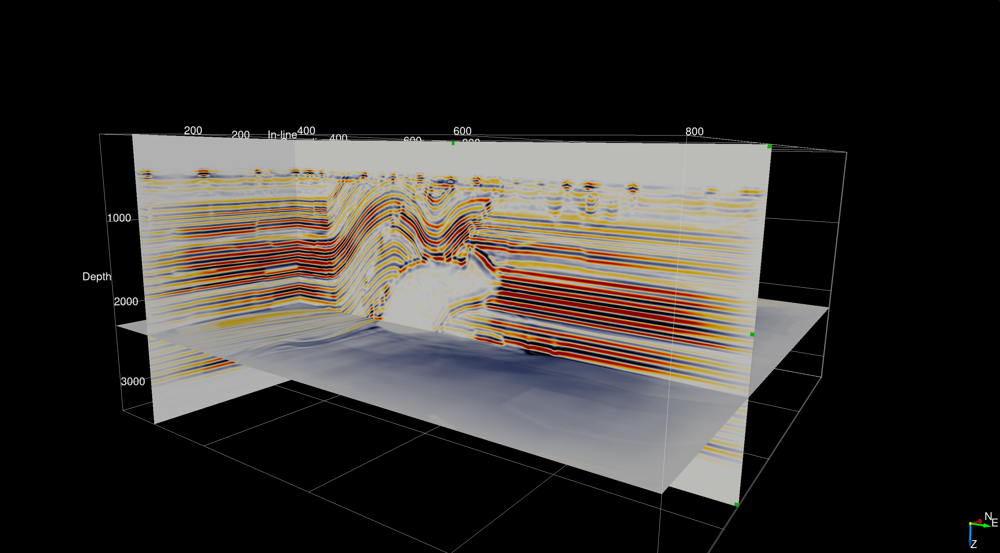
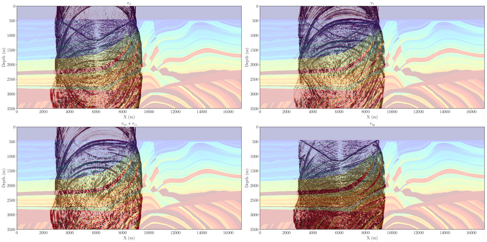

## Abstract

## Introduction

- Devito symbolic dsl + compiler
- Acoustic isotropic is trivial, real world is at the bare minimum elastic.
- Staggered finite-difference is tedious to implement and line-by-line vectorial equation is very time consuming and error-prone (9 equation for 3D elastic, 115 for viscoelastic).

Devito supports now Vectorial and second-order tensorial symbolic expressions and automatic finite-difference stencil generation. This support allows extremely simple and mathematical implementation of vectorial equation as the math writes.

Outline:
- Intro to devito
- Perf comp with thorbeck
- TTI RTM
- Elastic with vectorial extension


## Devito

Iro to devito

## Performance comparison

FIX FORMATING AND MORE DETAILS

[fdelmodc]:https://github.com/JanThorbecke/OpenSource.git
To furthermore validate the computational performance of Devito, and thanks to the vectorial extension I present in Section 5.3, I compared the runtime of Devito with a reference open source hand-coded propagator. This propagator, described in[@thorbecke] is an elastic kernel (c.f. 5.1) and has been implemented by J. W. Thorbecke who is a developer and benchmarker for Cray and Senior researcher in applied geophysics at Delft University of Technology. The source code can be found at [fdelmodc]. I compared the runtime of Devito against [fdelmodc] for a fixed and common computational setup from one of their examples:

- 2001 by 1001 physical grid points.
- 200 grid points of dampening layer on all four sides (total of 2401x1401 computational grid points).
- 10001 time steps.
- Single point source, 2001 receivers.
- Same compiler (gcc/icc) to compile [fdelmodc] and run Devito.
- Intel(R) Xeon(R) CPU E3-1270 v6 @ 3.8GHz.
- Single socket, four physical cores, four physical threads, thread pinning to cores and hyperthreading off.

The runtime results are summarized in Table~\ref{tab:bench-comp} and show on average that Devito performs around 75\% faster with the intel compiler and 40\% faster with gcc.

FIX FORMATING


#### Table: {#t0}
|   Compiler      |   Devito kernel  |  Devito runtime   |  FDELMODC runtime  | Kernel speedup | Runtime speedup|
|:----------------|:-----------------|:------------------|:-------------------|:---------------|:---------------|
| GCC 9.2.0       | 166.07s          |  172.83s          |     237.52s        | 1.430          | 1.374          |
| ICC 19.1.0      | 131.59s          |  136.85s          |     237.17         | 1.802          | 1.733          |
:Runtime comparison between Devito and [fdelmodc][@thorbecke] for a two dimensional elastic model. The first column shows the kernel runtime of Devito and the second column shows the total runtime including code generation and compilation. Only the runtime of [fdelmodc] is shown as the kernel and libraries are precompiled.

This comparison illustrate the performance achieved with Devito is at least on par with hand coded propagators. Future work will aim at providing a thorough benchmark by comparing first against a three dimensional implementations and second against state of the art stencil language.


## 3D anisotropic imaging


{>> Need more detail and perf<<}

For the major part of my Ph.D, I was lucky to have had access to a moderately size on-premise HPC cluster for running numerical experiments, without much consideration to cost. However, in recent years, our laboratory has made the choice to move the cloud. One of the main challenges in modern HPC is to modernize legacy codes for the cloud, which are usually hand-tuned or designed for on-premise clusters with a known and fixed architecture and setup. Porting these codes and algorithms to the cloud can be straightforward using a lift-and-shift strategy that essentially boils down to renting a cluster in the cloud. However, this strategy is not cost-efficient. Pricing in the cloud is typically based on a pay-as-you-go model, which charges for requested computational resources, regardless of whether or not instances and cores are actively used or sit idle. This pricing model is disadvantageous for the lift-and-shift strategy and oftentimes incurs higher costs than required by the actual computations, especially for communication-heavy but task-based algorithms that only need partial resources depending of the stage of the computation. On the other hand, serverless software design provides flexible and cost efficient usage of cloud resources including for large scale inverse problem such as seismic inversion. With Devito, we had access to a portable yet computationally efficient framework for wave-equation based seismic exploration that allowed us to quickly develop a new strategy to execute seismic inversion algorithms in the cloud. This new serverless and event-driven approach led to significant early results [@witte2019TPDedas, @witte2019SEGedw] that caught the attention of both seismic inverse problems practitioners and cloud providers. This led to a proof of concept project on an industry size problem in collaboration with Microsoft Azure. The main objectives of this project were:

- Demonstrate the scalability, robustness and cost effectiveness of a serverless implementation of seismic imaging in the cloud. In this case, we imaged a synthetic three dimensional anisotropic subsurface model that mimics a realistic industry size problem with a realistic representation of the physics (TTI). {>>May want to say how big model was roughly to be more concrete.<<}

- Demonstrate the flexibility and portability of Devito. The seismic image (RTM as defined in Chapter 3) was computed with Devito and highlights the code-generation and high performance capability of Devito on an at-scale real world problem. This result shows that in addition to conventional benchmark metrics such as soft and hard scaling and the roofline model, Devito provides state of the art performance on practical applications as well.

The subsurface velocity model that was used in this study is an artificial anisotropic model I designed and built combining two broadly known and used open-source SEG/EAGE acoustic velocity models. The anisotropy parameters are derived from smoothed version of the velocity while the tilt angles were derived from a combination of the smooth velocity models and vertical and horizontal edge detection. The final seismic image of the subsurface model is plotted in Figure #OverTTI and highlights the fact that 3D seismic imaging based on a serverless approach and automatic code generation is feasible and provides good results on a realistic model.


#### Figure: {#OverTTI}
{width=50%}
{width=50%}\
{width=50%}
{width=50%}\
: 3D TTI imaging on a custom made model.

@witte2019TPDedas fully describes the serverless implementation of seismic inverse problems, including iterative algorithms for least square minimization problems (LSRTM). The 3D anisotropic imaging results were presented as part of a keynote presentation at the EAGE HPC workshop in October 2019 [@herrmann2019EAGEHPCaii]. This work perfectly illustrates the flexibility and portability of Devito, as we were able to easily port a code only tested and developed on local hardware to the cloud, with only requiring minor adjustments. This portability included the possibility to run MPI-based code for domain decomposition in the cloud, after developing it on a desktop computer.


## Elastic modeling

{>> From thesis <<}

The elastic isotropic wave-equation, parametrized by the Lamé parameters ``\lambda, \mu`` and the density ``\rho`` reads:

```math{#elas1}
&\frac{1}{\rho}\frac{dv}{dt} = \nabla . \tau \\
&\frac{d \tau}{dt} = \lambda tr(\nabla v) \mathbf{I}  + \mu (\nabla v + (\nabla v)^T)
```

where ``v`` is a vector valued function with one component per cartesian direction:

```math{#partvel}
v =  \begin{bmatrix} v_x(t, x, y, z) \\ v_y(t, x, y)) \end{bmatrix}
```

and the stress ``\tau`` is a symmetric second-order tensor-valued function:

```math{#stress}
    \tau = \begin{bmatrix}\tau_{xx}(t, x, y) & \tau_{xy}(t, x, y)\\\tau_{xy}t, x, y) & \tau_{yy}(t, x, y)\end{bmatrix}.
```

The discretization of such a set of coupled PDEs requires five equations in two dimensions (two equations for the particle velocity and three for stress) and nine equations in three dimensions (three particle velocities and six stress equations). However the mathematical definition only requires two coupled vector/tensor-valued equations for any number of dimensions. The main contribution of this work is to extend the previously scalar-only capabilities of Devito to vector and second-order tensors and allow a straightforward and mathematical definition of high-dimensional PDEs such as the elastic wave equation in Eq #elas1\.


### Vectorial and tensorial API

Once again, based on `sympy`, I recently extended the symbolic interface to vectorial and tensorial object to allow for a straightforward definition of equations such as the elastic wave-equation, as well as computational fluid dynamics equations. The extended API defines two new types, `VectorFunction` (and `VectorTimeFunction`) for vectorial objects such as the particle velocity, and `TensorFunction` (and `TensorTimeFunction`) for second-order tensor objects (matrices) such as the stress. These new objects are constructed the exact same way as the previously scalar `Function` objects and automatically implement staggered grid and staggered finite-differences with the possibility of half-node averaging. This new extended API now allows users to define the elastic wave-equation in four lines as follows:


### Elastic modeling

```python
v = VectorTimeFunction(name='v', grid=model.grid, space_order=so, time_order=1)
tau = TensorTimeFunction(name='t', grid=model.grid, space_order=so, time_order=1)

u_v = Eq(v.forward, model.damp * (v + s/rho*div(tau)))
u_t = Eq(tau.forward,  model.damp *  (tau + s * (l * diag(div(v.forward)) +
                                                mu * (grad(v.forward) + grad(v.forward).T))))
```

The `sympy` expressions created by these commands can be displayed via the `sympy` pretty printer (`sympy.pprint`) as shown in Figure #PrettyElas\. This representation reflects perfectly the mathematics while still providing computational portability and efficiency through the Devito compiler.

#### Figure: {#PrettyElas}
{width=100%}
: Update stencil for the particle velocity. The stencil for updating the stress component is left out for readability, as the equation does not fit onto a single page. However, it can be found in the Devito tutorial on elastic modeling.

Each component of a vectorial or tensorial object is accessible via conventional vector and matrix indices (i.e. `v[0], t[0,1],....`). I show the elastic particle velocity and stress for a well known 2D synthetic model, the elastic marmousi-ii[@versteeg927, @marmouelas] model. The wavefields are shown on Figure #ElasWf and its corresponding elastic shot records are displayed in Figure #ElasShot\.

#### Figure: {#ElasWf}
{width=100%}
: Particle velocities and stress at time ``t=3\text{s}`` for a source at 10m depth and `x=5\text{km}` in the marmousi-ii model.

#### Figure: {#ElasShot}
{width=30%}
{width=30%}
{width=30%}
: Seismic shot record for 5sec of modeling. `a` is the pressure (trace of stress tensor) at the surface (5m depth), `b` is the vertical particle velocity and `c` is the horizontal particle velocity at the ocean bottom (450m depth).


## Discussion


## Conclusions


## References
